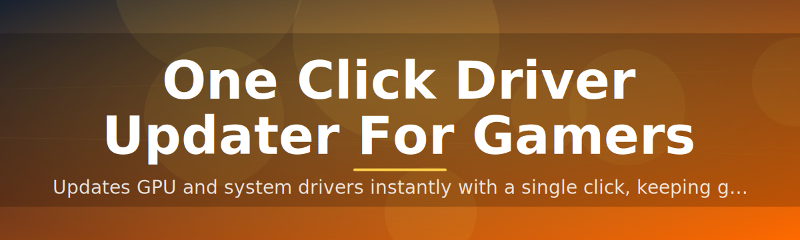
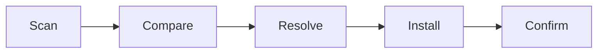

# driver-updater-utility 🎮⚡

  

*Stale GPU drivers cost frames. One click fixes that.*

  

<strong>📖 The full story — why this exists</strong>

 

It started with a dropped frame during a ranked match. Not lag — a driver three versions behind, silently throttling a GPU that should've been flying. Manual driver hunting means five browser tabs, a vendor login you forgot the password to, and a `.exe` that reboots your machine mid-download.

`driver-updater-utility` was built by gamers tired of babysitting hardware. It scans your rig, cross-references a live component database, and surfaces exactly what's outdated — GPU, chipset, network, audio — without the bloatware vendors love to bundle. No account creation. No telemetry theater. Just a scan, a diff, and a fix.

The project grew from a weekend script into a maintained utility because the problem never went away: new GPU drivers ship weekly, game patches demand day-one compatibility, and most players don't have time to chase changelogs across four different manufacturer portals.

---

## 🧭 Overview

`driver-updater-utility` is a lightweight Windows tool built for one job: keeping gaming hardware running on its latest, most stable drivers without the manual grind. It targets the specific pain of PC gamers — GPU driver rot, chipset mismatches, audio latency from outdated codecs, and network adapters that silently degrade over months of Windows updates.

Unlike generic system-maintenance suites that treat drivers as an afterthought buried under registry cleaners and "PC health scores," this utility is purpose-built around gaming performance. It prioritizes GPU and input-device drivers first, because those are the components that actually move your frame counter and your reaction time. Everything else — network stack, chipset, audio — gets checked too, but the hierarchy respects what gamers actually care about.

It's for the competitive player who can't afford a driver-induced stutter mid-tournament, the casual player who just wants new releases to run without a black-screen crash, and the builder who swaps GPUs often enough that manual updates became a chore years ago. If you've ever asked "wait, is this driver even the latest one?" — this is the answer.

## 📥 Get It

> [!NOTE]
> The button above goes to our official landing page — the only place we distribute builds. We don't publish standalone links anywhere else.

---

## 🚀 What It Actually Does

| Capability | The Fresh Angle |
|---|---|
| **One-click scanning** | A single button triggers a full hardware sweep — no wizards, no "next, next, next." |
| **Gaming-priority ranking** | GPU and input drivers surface first; your motherboard's obscure USB controller waits its turn. |
| **Silent background updates** | Updates apply while you browse patch notes — no forced reboots unless the driver itself demands one. |
| **Rollback safety net** | Every update snapshots the previous driver, so a bad release is one click from undone. |
| **Offline driver cache** | Downloaded packages stay cached locally for reinstalls without re-fetching bandwidth. |
| **Vendor-agnostic detection** | Works across GPU, chipset, audio, and network hardware — not locked to a single manufacturer. |
| **Changelog digest** | Each update ships with a plain-English summary of what actually changed, no marketing fluff. |
| **Lightweight footprint** | No background services, no startup entries fighting for RAM your game needs. |

> [!TIP]
> Run a scan right after installing a new game — day-one patches often assume drivers newer than what shipped with your PC.

---

## 🏁 Getting Started

1. **Visit** the landing page via the download button above.

2. **Download** the standalone executable — no installer wizard, no bundled extras.

3. **Run** the app directly; Windows may show a SmartScreen prompt on first launch since the binary is freshly signed each release.

4. **Scan and apply** — hit the one-click scan, review the results table, and confirm updates.

> [!IMPORTANT]
> Close fullscreen games before applying GPU driver updates. Some updates require the display driver to briefly restart.

---

## 🖥️ System Requirements

| Component | Requirement |
|---|---|
| OS | Windows 10 (64-bit) or Windows 11 |
| Disk | ~150 MB free for the app + driver cache |
| RAM | 4 GB minimum, 8 GB recommended |
| Dependencies | None — fully standalone |
| Internet | Required for scanning and downloading driver packages |

  

---

## ⚙️ How It Works

The flow is intentionally short — fewer steps means fewer places for something to break mid-update.

1. **Detect** — enumerates installed hardware via Windows device APIs.
2. **Compare** — checks each component's driver version against a maintained reference database.
3. **Resolve** — picks the correct, stable package for your exact hardware revision.
4. **Apply** — downloads, verifies, and installs in the background.
5. **Confirm** — reports success and offers a rollback point if anything looks off.

---

## 🧩 Troubleshooting

**Q: My GPU still shows the old driver version after updating.**
A: Reboot once. Some display drivers don't fully unload until the next session starts.

**Q: The scan found nothing to update — is that normal?**
A: Yes. If everything's current, the tool reports a clean status instead of manufacturing fake updates.

**Q: Windows SmartScreen flagged the download.**
A: Expected for a new-release binary with limited reputation history. Click "More info" → "Run anyway," or verify the file hash on the landing page.

**Q: A driver update caused instability — how do I revert?**
A: Open the History tab, select the previous snapshot, and click Rollback. This restores the exact prior driver package.

**Q: Does this work with laptop GPUs (hybrid graphics)?**
A: Yes, both integrated and discrete GPUs are detected and updated independently.

**Q: Can I update just the GPU and skip everything else?**
A: Yes — the results table lets you deselect any category before applying.

---

## 🎨 UI / UX Notes

Keyboard shortcuts & interface details

 

| Shortcut | Action |
|---|---|
| `Ctrl + R` | Run a fresh scan |
| `Ctrl + Z` | Open rollback history |
| `Ctrl + ,` | Open settings |
| `F5` | Refresh results table |
| `Esc` | Cancel an in-progress update |

- **Themes:** Dark (default), Light, and a high-contrast mode for streaming overlays.

- **Settings:** toggle auto-scan on startup, choose update-check frequency, set bandwidth caps for downloads.

- **Notifications:** optional toast alerts when a new driver drops for your exact GPU model.

---

## 🤝 Contributing & Community

> [!TIP]
> First-time contributors: check issues tagged `good-first-issue` — small, scoped, and reviewed fast.

This project runs on community input, not a closed roadmap. Driver detection logic, UI polish, and hardware compatibility reports all come from people actually using the tool on real rigs.

- **Discussions** — share hardware compatibility results, request support for niche devices, propose features.

- **Roadmap** — public and community-voted; upcoming priorities include broader laptop GPU coverage and a lighter background-scan mode.

- **Issues** — bug reports with your hardware spec and Windows build number get triaged first.

- **Pull requests** — welcome for detection accuracy, UI improvements, and documentation fixes.

> [!WARNING]
> Please don't submit driver packages directly in issues or PRs — link to the official manufacturer source instead. We verify everything before it touches the reference database.

---

## 📜 License

Released under the [MIT License](LICENSE), 2026.

---

## ⚠️ Disclaimer

This tool installs third-party hardware drivers sourced from official manufacturer channels. Always back up your system before major driver changes. The maintainers are not responsible for hardware issues arising from manufacturer-side driver defects — use the rollback feature if an update misbehaves.

> [!NOTE]
> This project is community-maintained and not officially affiliated with NVIDIA, AMD, Intel, or any hardware manufacturer named in compatibility notes.

